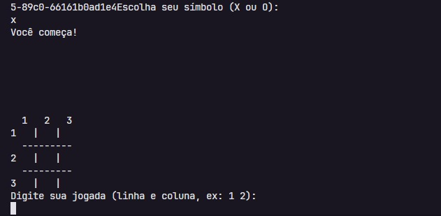
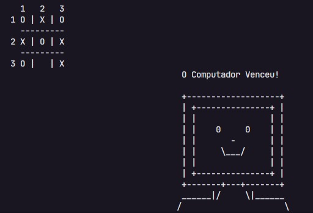
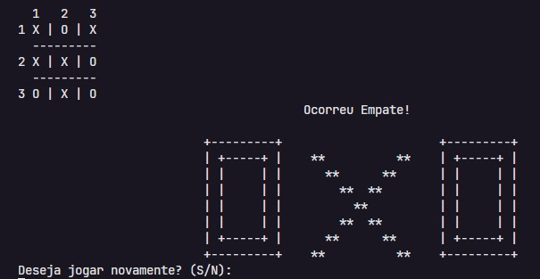

<h1 align="center">
   🎮 Jogo da Velha Game!
</h1>

####  Esse pequeno Jogo da Velha, desenvolvido em Java, foi criado por mim e minha equipe durante uma incrível experiência na hackathon do programa 1000Devs da Mesttra.      
* #### O objetivo do hackathon era maximizar o trabalho em equipe. Cada membro da equipe assumiu funções específicas e, ao final, reunimos nossos códigos para finalizar o projeto. Foi uma excelente oportunidade para fortalecer nossas habilidades colaborativas e técnicas. 🚀

---
<h1 align="center">
🕹️ O jogo tem as seguintes funcionalidades..
</h1>

- No jogo, você começa escolhendo se deseja jogar com o símbolo (X) ou (O). 
- Após a seleção, você escolhe as posições no tabuleiro onde deseja jogar.
- No final da partida, o jogo exibe quem foi o vencedor , seja você ou o computador, ou se houve um empate.

---
<h1 align="center">

</h1>

